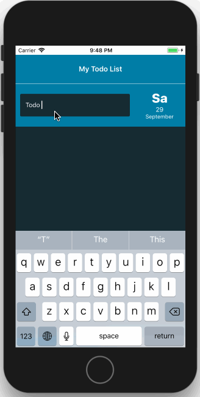

# A Simple Todo App

## Description

A React Native Todo App integrated with Redux. <i>Developed for training purposes<i>




## Development

Type the command

```yarn ios``` - for running the app on iOS simulator

or

```yarn android``` - for running the app on a connected Android phone/emulator.

Note that for "yarn run android" to work, you should have an open Android emulator or an Android device with USB Debugging enabled connected to your system via a USB cable.

## Project Structure

```
├── src
│   ├── assets
│   ├── components
│   ├── config
│   ├── pages
│   ├── redux
│   ├── routes
│   ├── styles
│   └── utils
```

## Convention and Code Styles

#### ESLint

ESLint is a tool that allows us to maintain code quality and enforce code conventions. ESLint is a static code evaluator. Basically, it means that ESLint will not actually execute the code but will instead read through the source code to see if all the preconfigured code conventions are followed by the developers.

```
yarn add --dev eslint babel-eslint eslint eslint-plugin-react eslint-plugin-react-native
```

ESLint rules can be configured via a configuration file .eslintrc which should be placed in the root directory of the project.

The complete list of all the available rules is present here: http://eslint.org/docs/rules/


#### Git Pre-push/Pre-commit Hooks

Pre-push/Pre-commit hooks are nothing but commands which you would want to run every time you push/commit something. It might not sound very interesting, but using them with Jest and ESLint can protect the quality of your code at a much, much higher level.

Pre hooks run a shell command which you specify and if the command fails with exit status 1, the process will get terminated. We store the shell commands inside the .git/hooks directory of the root of the project. <b>So imagine that you won't be able to push the code if your tests are failing or your js files are not properly linted.</b>

```
yarn add --dev husky
```

If for some reason you want to bypass this mechanism your can add the --no-verify flag before doing your commit.

> Note: In the case of Windows machines, make sure that you have bash(Cygwin). Prepush hooks will fail if you use Command Prompt